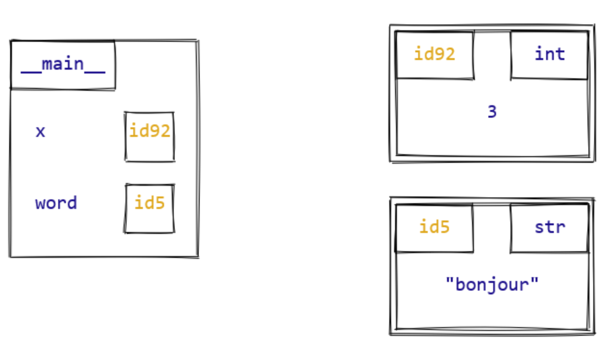

## Stack vs Heap

### Heap Memory

All actual data objects (like integers, strings, lists, and dictionaries) are stored in the private heap

cleared by garbage collection

slower due to dynamic pointer look ups

### Stack Memory

stack memory only stores function call frames and references (pointers) to those heap objects (local variable names, object references)

deleted instantly when a function call finishes

fast, sequential access

## References and Mutability

variables do not store the actual data value directly; instead they act as a names or pointers that reference objects stored in the heap memory

1.  Checking Object Indentity

- verify unique memory location of an object using built-in **id()** method
- To check that two variables point to the exact same object in memory, use the **is** operator

```python
a = [1, 2, 3]
b = a  # b references the exact same list object as a

print(id(a) == id(b))  # True
print(a is b)          # True
```

2. Shared References and Mutability

- The way references behave during modifications depends entirely on whether the target object is mutable or immutable
- **Immutable (Integrers, Strings, Tuples)**: they cannot be changed in place modifying that variables forces python to create a brand new object at a new memory address leaving other variables pointing to the original object unchanged
- **Mutable Objects (Lists, Dicts, Sets)**: they can be changed in place. if multiple variables share a reference to a mutable object, updating the object through one variable changes it for all of them.

## Garbage Collection

Python automatically tracks how many references point to an object via an internal mechanism called a **reference counter**.

When an object's reference count drops to zero—meaning no variables, structures, or properties point to it, it becomes an "orphaned object" and is safely deleted from memory via python **garbage collection**.

While CPython cleans up most objects instantly using Reference Counting, it cannot clean up objects that point to each other in a loop (circular references). The gc module exists specifically to find, break, and clear these cyclic memory loops

## Weak References

Normal assignments create "strong references" that keep objects alive in memory. If you need to reference an object without preventing it from being garbage collected (such as when building a temporary cache), you can use the built-in Python weakref library.

## How Python Stores an Object



objects are stored in private heap memory

Under the hood, every Python object is built on top of a C struct called PyObject. It contains a minimum of three crucial metadata entries:

- Identity (ob_refcnt): A reference count tracking how many variables point to this object.
- Type (ob_type): A pointer to another object describing the data type (e.g., int, str).
- Value: The actual data stored. For example, an integer extends this struct to hold its numeric value.
